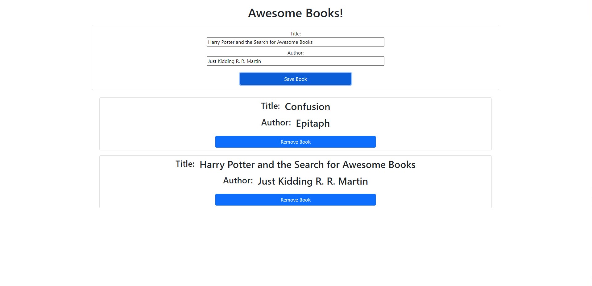

# Awesome-books
A project to keep track of books a user has read, using JS and basic HTML/ CSS

## Project Decription
A lightweight JavaScript project that allows users to interact with a fully client-based interface.
Users can add books that they own to easily keep track of their list of books.
The added books can be removed from the list by using the "Remove Book" button.

## Project Design
The books are displayed on cards to separate them, allowing for a tidier experience for the users.
The project solely uses Bookstrap, and no CSS at all, as it's a JavaScript practice project.

## Screenshot of the page

## Build With

- HTML
- JAVASCRIPT
- BOOTSTRAP

## Live Version Link

[Click Here!](https://polinastamenova.github.io/Awesome-books/)

## Contributors

👤 **Onur Onat Surmeli**

- [GitHub](https://github.com/Zibilyonik)
- [Twitter](https://twitter.com/OnurSurmeli2)
- [LinkedIn](https://www.linkedin.com/in/onuronatsurmeli/)

👤 **Polina Stamenova**

- [GitHub](https://github.com/PolinaStamenova)
- [LinkedIn](https://www.linkedin.com/in/polina-stamenova-a60766112/)

## 🤝 Contributing

Contributions, issues and feature requests are welcome!

Feel free to check the [issues page](issues/).

## Show your support

Give a ⭐️ if you like this project!

